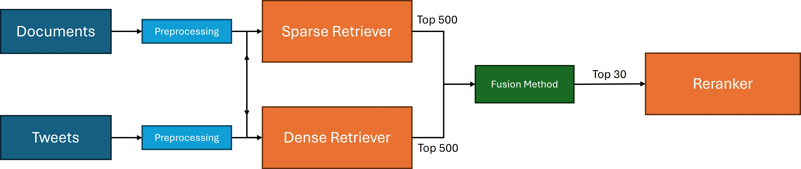

# CheckThat CLEF 2026 Source Retrieval

This repository contains the retrieval, evaluation, demo, and dense-retriever
fine-tuning code for the CLEF 2026 CheckThat! Task 1 source retrieval work. The
task is to retrieve the scientific publication implicitly referenced by a social
media claim across English, German, and French queries.

The project is organized as a Python `uv` workspace with three package-level
entrypoints:

- `src/clef_pipeline/` contains the Modal-backed retrieval and evaluation
  pipeline.
- `src/clef_demo/` contains the Streamlit demo and its Modal backend.
- `src/clef_training/` contains hard-negative mining and BGE-M3 LoRA
  fine-tuning scripts.

## Architecture

The production path is Modal-backed because the heavier retrievers and rerankers
need GPU resources and persistent caches.

- Dense retrieval supports Harrier and fine-tuned BGE-M3 variants.
- Sparse retrieval uses BM25-style lexical retrieval with optional bigrams and
  translation support.
- Fusion supports reciprocal rank fusion (`rrf`) and a learned Random Forest
  fuser (`random_forest`).
- Reranking supports Nemotron, Gemma, Jina, and Qwen registry names.
- Submission export writes Codabench-ready `predictions_{lang}.tsv` files.

The pipeline reads the public Hugging Face dataset
`sschellhammer/CT26_Task1_SourceRetrievalForScientificWebClaims` and caches
expensive artifacts in Modal volumes.



## Results

The table below shows the progression across the 14 ablation configurations
evaluated on the development set (MRR@5).

To reproduce these runs, use the ablation commands in the
[pipeline guide](src/clef_pipeline/README.md#ablation-commands).

| # | Model Configuration | English | German | French | Avg. |
|---:|---|---:|---:|---:|---:|
| 0 | CheckThat! Baseline | 0.4987 | 0.3767 | 0.4584 | 0.4446 |
| 1 | Vanilla BM25 Sparse Retriever | 0.4991 | 0.1973 | 0.2634 | 0.3199 |
| 2 | Optimized Sparse Retriever | 0.5514 | 0.3987 | 0.5511 | 0.5004 |
| 3 | BGE-M3 Dense Retriever | 0.5244 | 0.4129 | 0.5328 | 0.4900 |
| 4 | Finetuned BGE-M3 Dense Retriever | 0.5728 | 0.5044 | 0.5892 | 0.5555 |
| 5 | Harrier 27B Dense Retriever  | 0.6943 | 0.5892 | 0.7051 | 0.6628 |
| 6 | Hybrid (Optimized Sparse + Harrier) + RRF Fusion | 0.6325 | 0.5103 | 0.6440 | 0.5956 |
| 7 | Hybrid (Optimized Sparse + Harrier) + Random Forest Fusion | 0.7000 | 0.5937 | 0.7127 | 0.6688 |
| 8 | Hybrid + Random Forest Fusion + Nemotron Reranker | 0.7391 | 0.6244 | 0.7343 | 0.6993 |
| 9 | Hybrid + RRF Fusion + Nemotron Reranker | 0.7311 | 0.6166 | 0.7273 | 0.6917 |
| 10 | Harrier 27B Dense + Nemotron Reranker | 0.7388 | 0.6190 | 0.7347 | 0.6975 |
| **11** | **Hybrid + Random Forest Fusion + Qwen3 8B Reranker** | **0.7584** | **0.6943** | **0.7850** | **0.7459** |
| 12 | Hybrid + RRF Fusion + Qwen3 8B Reranker | 0.7474 | 0.6896 | 0.7794 | 0.7388 |
| 13 | Hybrid + Random Forest Fusion + Jina Reranker | 0.6952 | 0.6203 | 0.7026 | 0.6727 |
| 14 | Hybrid + RRF Fusion + Jina Reranker | 0.6881 | 0.6089 | 0.6989 | 0.6653 |

## Setup

Install `uv`, sync the workspace, and authenticate required services:

```bash
brew install uv
uv sync

# Modal account setup
uv run modal setup

# Hugging Face token for gated/private model access inside Modal
uv run modal secret create hf-token HF_TOKEN=hf_XXXXXXXXXXXXXXXXXXXXXXXXXXXX
```

You also need access to the configured Hugging Face model repositories used by
the selected retriever/reranker profile.

## Common Commands

Run the default Modal evaluation pipeline:

```bash
uv run modal run -d -m clef_pipeline.main
```

Run a lightweight retrieval-only evaluation:

```bash
uv run modal run -d -m clef_pipeline.main \
  --profile retrieval-only \
  --disable-reranker
```

Generate competition submission TSV files:

```bash
uv run modal run -m clef_pipeline.main \
  --split test \
  --export-submission-tsv \
  --submission-volume-subdir submissions \
  --submission-download-dir submissions
```

Deploy the demo backend and serve the Streamlit app:

```bash
uv run modal deploy src/clef_demo/clef_demo/backend.py
uv run modal serve -m clef_demo.modal_app
```

Run local development checks:

```bash
uv run ruff format
uv run ruff check
uv run pytest
```

Some tests or workflows can import model-heavy packages. Full evaluation,
deployment, and training require Modal and are not expected to run as part of a
lightweight local smoke check.

## Documentation

- [Pipeline guide](src/clef_pipeline/README.md) covers evaluation, profiles,
  caching, ablations, and Codabench export.
- [Demo guide](src/clef_demo/README.md) covers the Streamlit UI and Modal demo
  deployment.
- [BGE fine-tuning guide](src/clef_training/README.md) covers hard-negative
  mining, Modal training, and model download.

## Repository Layout

```text
.
├── src/
│   ├── clef_pipeline/   # Retrieval, fusion, reranking, metrics, submissions
│   ├── clef_demo/       # Streamlit app and Modal web/backend apps
│   ├── clef_training/   # Hard-negative mining and BGE-M3 LoRA training
├── scripts/             # Analysis and supporting data collection utilities
├── tests/               # Unit and regression tests
├── pyproject.toml       # Workspace metadata and dependencies
├── uv.lock              # Locked dependency graph
└── LICENSE              # MIT license
```

## Publication Notes

- Do not commit local `.env` files, downloaded submissions, model checkpoints,
  embedding caches, or Modal volume contents.
- The official `test` split is unlabeled; it can generate submissions but cannot
  produce local metrics.
- The default heavy profile uses large GPU models. Prefer the documented demo or
  retrieval-only profiles for quick iteration.
- The code is released under the MIT license. Dataset and model usage are
  governed by their upstream licenses and access policies.
